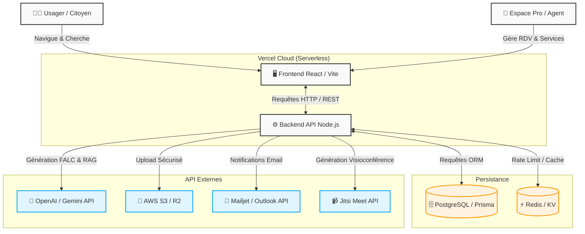
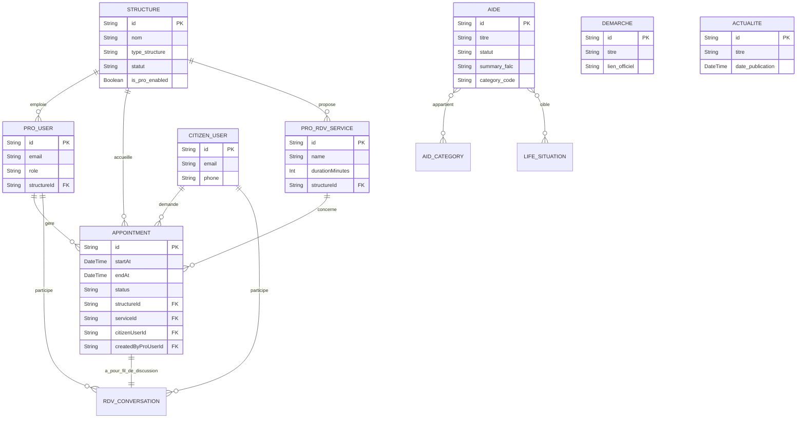
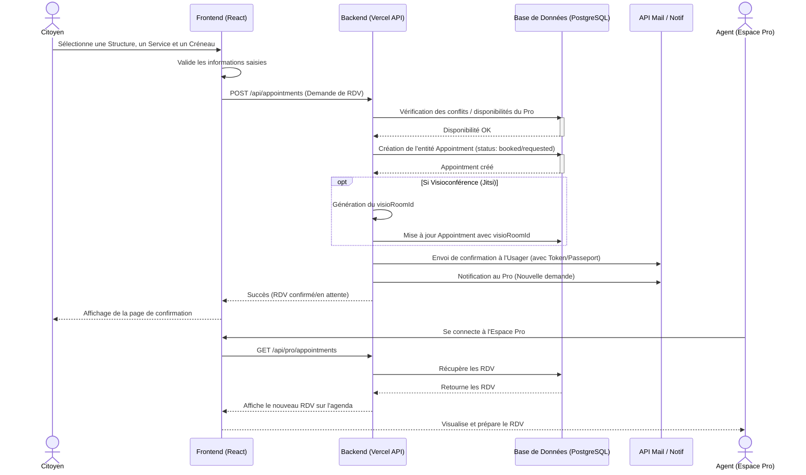

# 📖 WIKI VISUEL - Accès Direct Aide

Bienvenue dans le Wiki Visuel du projet **Accès Direct Aide**. Ce document présente l'architecture globale, le modèle de données principal, et le parcours utilisateur clé de l'application.

## 🌍 Présentation du Projet

**Accès Direct Aide** a pour but de simplifier, centraliser et sécuriser l'accès à l'information et à l'accompagnement social, avec une philosophie **Zero-Knowledge** (chiffrement de bout en bout).

Le projet s'adresse à deux publics :
1. **Les Citoyens (Bénéficiaires) :** Recherchent des aides (traduites en FALC par l'IA), prennent rendez-vous et échangent des documents de manière sécurisée sans compte classique (Passeport/Token).
2. **Les Professionnels (Structures Sociales, Agents) :** Utilisent un espace dédié (Espace Pro) pour gérer leur disponibilité, accepter des rendez-vous (en présentiel ou visioconférence avec Jitsi), réaliser des rapports d'impact et communiquer de manière chiffrée.

Le système est construit en mode **Serverless** sur **Vercel** avec un backend **Node.js/Prisma** et une base **PostgreSQL**. L'IA (OpenAI/Gemini) motorise la Boussole Sociale (RAG) et la simplification FALC.

---

## 1. Diagramme d'Architecture Globale

Ce schéma illustre la connexion entre le Frontend, le Backend (Vercel), la Base de données et les principales API externes.

---

## 2. Modèle de Base de Données Principal (ER Diagram)

Voici le modèle de données simplifié (Entity-Relationship) représentant les entités fondamentales extraites du fichier `schema.prisma`.

---

## 3. Parcours Utilisateur : Prise de Rendez-vous (Sequence Diagram)

Ce diagramme illustre le flux lorsqu'un Usager Citoyen prend un rendez-vous (classique ou visio) avec une structure Pro.

