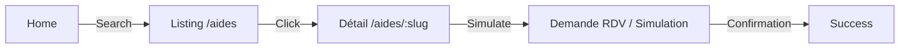

# 02 - Target Map (From Blueprint)

**Source:** Blueprint NotebookLM (Reconstruit via Knowledge Base)
**Status:** Cible (Target)

## 1. Architecture Cible & Invariants

Le Blueprint impose une architecture **Monorepo Hybride (Vite + Serverless)** stricte avec les invariants suivants :

### A. Core Invariants
1.  **Traceability (SHA-256)**
    *   **Exigence:** Chaque réponse API et chaque page Front doit contenir le SHA du commit (`x-release-sha` header / `window.makeRelease`).
    *   **But:** Débogage immédiat de la version en cours.
2.  **Unified Resource Handlers**
    *   **Exigence:** UN seul handler par entité (ex: `api/_handlers/aides.js`) gère à la fois le Public (GET filtré) et l'Admin (CRUD complet).
    *   **Pattern:** `verifyAdmin(req)` détermine la visibilité des brouillons ("NeedsReview").
3.  **Review Queue & Moderation**
    *   **Exigence:** Tout contenu créé/modifié passe par un état "Brouillon" ou "À revoir".
    *   **UI:** Admin "Inbox" centralisée pour validation.
4.  **RGPD "Zero-Call" & Encryption**
    *   **Exigence:** Aucune donnée sensible (PII) en clair en base.
    *   **Technique:** Chiffrement champ à champ (AES-256) + Hachage pour lookup. Clé `ADA_ENCRYPTION_KEY` rotative (pas de dur).
5.  **Fail-Fast Security**
    *   **Exigence:** L'app ne démarre pas si les clés critiques (Encryption, Cron Secret) sont absentes.

## 2. Flux Target (Mermaid)

### A. Flux Utilisateur (User Flow)


### B. Flux Ingestion & Data (Data Pipeline)
```mermaid
graph TD
    Cron[Vercel Cron] -->|Trigger| Pipeline[api/cron/pipeline.js]
    Pipeline -->|Fetch| Sources[Sources Externes (RSS/API)]
    Sources -->|Normalize| Transformer[Transformateur de Données]
    Transformer -->|Validate| Validator[Zod Schema Validation]
    Validator -->|Upsert| DB[(PostgreSQL / Prisma)]
    DB -->|Read (Filtered)| API[Unified Handler]
    API -->|Display| UI[Frontend React]
```

## 3. Structure Idéale des Dossiers (Target)

```
/
├── api/
│   ├── index.js            # Dispatcher unique
│   ├── _handlers/          # Handlers Unifiés (Aides, Structures, etc.)
│   ├── _utils/
│       ├── auth.js         # Unified Auth (JWT + Token)
│       └── crud.js         # Standardized CRUD Logic
├── src/
│   ├── modules/            # (Target) Organisation par domaine ? (TBD)
│   ├── api/client.js       # Client API typé
└── scripts/
    └── release/            # Scripts de release/verify standardisés
```
